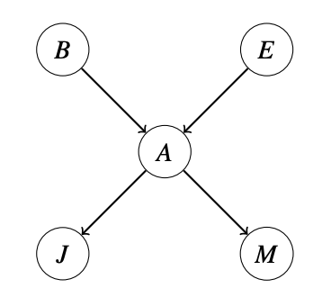

# 6.3 Bayesian Network Representation

While inference by enumeration can compute probabilities for any query we might desire, representing an entire joint distribution in the memory of a computer is impractical for real problems — if each of $$n$$ variables we wish to represent can take on $$d$$ possible values (it has a **domain** of size $$d$$), then our joint distribution table will have $$d^n$$ entries, exponential in the number of variables and quite impractical to store!

Bayes nets avoid this issue by taking advantage of the idea of conditional probability. Rather than storing information in a giant table, probabilities are instead distributed across a number of smaller conditional probability tables along with a **directed acyclic graph** (DAG) which captures the relationships between variables. The local probability tables and the DAG together encode enough information to compute any probability distribution that we could have computed given the entire large joint distribution. We will see how this works in the next section.

We formally define a Bayes Net as consisting of:

1.A directed acyclic graph of nodes, one per variable $$X$$.

2.A conditional distribution for each node $$P(X | A1 ... An)$$, where $$Ai$$ is the $$i$$th parent of $$X$$, stored as a **conditional probability table** or CPT. Each CPT has $$n+2$$ columns: one for the values of each of the $$n$$ parent variables $$A1 ... An$$, one for the values of $$X$$, and one for the conditional probability of $$X$$ given its parents.

The structure of the Bayes Net graph encodes conditional independence relations between different nodes. These conditional independences allow us to store multiple small tables instead of one large one.

It is important to remember that the edges between Bayes Net nodes do not mean there is specifically a _causal_ relationship between those nodes, or that the variables are necessarily dependent on one another. It just means that there may be _some_ relationship between the nodes.

As an example of a Bayes Net, consider a model where we have five binary random variables described below:

- **B**: Burglary occurs.
- **A**: Alarm goes off.
- **E**: Earthquake occurs.
- **J**: John calls.
- **M**: Mary calls.

Assume the alarm can go off if either a burglary or an earthquake occurs, and that Mary and John will call if they hear the alarm. We can represent these dependencies with the graph shown below.

In this Bayes Net, we would store probability tables $$P(B)$$, $$P(E)$$, $$P(A | B, E)$$, $$P(J | A)$$ and $$P(M | A)$$.

Given all of the CPTs for a graph, we can calculate the probability of a given assignment using the following rule:

$$P(X1, X2, ..., Xn) = \prod_{i=1}^n{P(X_i | parents(X_i))}$$

For the alarm model above, we can actually calculate the probability of a joint probability as follows:

$$P(-b, -e, +a, +j, -m) = P(-b) \cdot P(-e) \cdot P(+a | -b, -e) \cdot P(+j | +a) \cdot P(-m | +a)$$

We will see how this relation holds in the next section.

As a reality check, it's important to internalize that Bayes Nets are only a type of model. Models attempt to capture the way the world works, but because they are always a simplification they are always wrong. However, with good modeling choices they can still be good enough approximations that they are useful for solving real problems in the real world.

In general, a good model may not account for every variable or even every interaction between variables. But by making modeling assumptions in the structure of the graph, we can produce incredibly efficient inference techniques that are often more practically useful than simple procedures like inference by enumeration.
