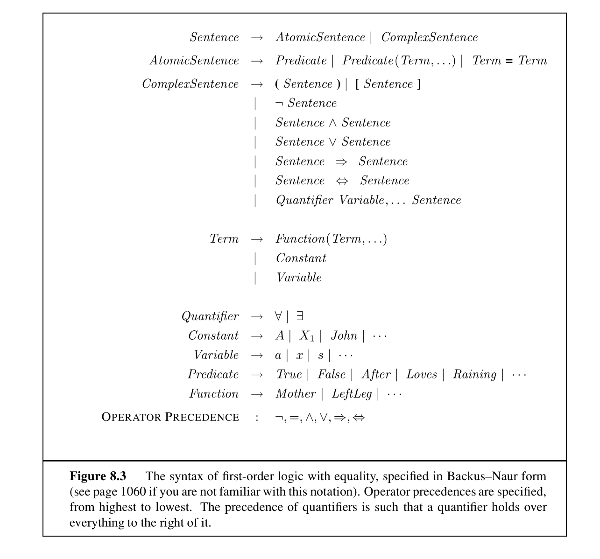

# 11.7 First Order Logic

The second dialect of logic, **first-order logic (FOL)**, is more expressive than propositional logic and uses objects as its basic components. With first-order logic we can describe relationships between objects and apply functions to them. Each object is represented by a **constant symbol**, each relationship by a **predicate symbol**, and each function by a **function symbol**.

The following table summarizes the first order logic syntax.

**Terms** in first-order logic are logical expressions that refer to an object. The simplest form of terms are constant symbols. However, we don't want to define distinct constant symbols for every possible object. For example, if we want to refer to John's left leg and Richard's left leg, we can do so by using **function symbols** like `Leftleg(John)` and `Leftleg(Richard)`. Function symbols are just another way to name objects and are not actual functions.

**Atomic sentences** in first-order logic are descriptions of relationships between objects, and are true if the relationship holds. An example of an atomic sentence is `Brother(John, Richard)` which is formed by a predicate symbol followed by a list of terms inside the parentheses. **Complex sentences** of first-order logic are analogous to those in propositional logic and are atomic sentences connected by logical connectives.

Naturally, we would like ways to describe entire collections of objects. For this we use **quantifiers**. The **universal quantifier** $$\forall$$, has the meaning "for all," and the **existential quantifier** $$\exists$$, has the meaning "there exists."

For example, if the set of objects in our world is the set of all debates, the sentence $$\forall a, ~ TwoSides(a)$$ could be translated as "there are two sides to every debate". If the set of objects in our world is people, the sentence $$\forall x, \exists y, ~ SoulMate(x, y)$$ would mean "for all people, there is someone out there who is their soulmate." The **anonymous variables** $$a, x, y$$ are stand-ins for objects, and can be **substituted** for actual objects, for example, substituting Laura for $$x$$ into our second example would result in a statement that "there is someone out there for Laura."

The universal and existential quantifiers are convenient ways to express a conjunction or disjunction, respectively, over all objects. It follows that they also obey De Morgan's laws (note the analogous relationship between conjunctions and disjunctions):

Finally, we use the **equality symbol** to signify that two symbols refer to the same object. For example, the incredible sentence $$\left(Wife(Einstein) = First Cousin(Einstein) \wedge Wife(Einstein) = Second Cousin(Einstein)\right)$$ is true!

Unlike with propositional logic, where a model was an assignment of true or false to all proposition symbols, a model in first-order logic is a mapping of all constant symbols to objects, predicate symbols to relations between objects, and function symbols to functions of objects. A sentence is true under a model if the relations described by the sentence are true under the mapping. While the number of models of a propositional logical system is always finite, there may be an infinite number of models of a first-order logical system if the number of objects is unconstrained.

These two dialects of logic allow us to describe and think about the world in different ways. With propositional logic, we model our world as a set of symbols that are true or false. Under this assumption, we can represent a possible world as a vector, with a 1 or 0 for every symbol. This binary view of the world is what is known as a **factored representation**. With first-order logic, our world consists of objects that relate to one another. This second object-oriented view of the world is known as a **structured representation**, is in many ways more expressive and is more closely aligned with the language we naturally use to speak about the world.