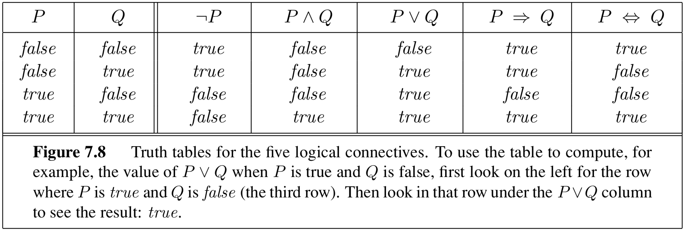

# 11.2 The Language of Logic

Just as with any other language, logic sentences are written in a special **syntax**. Every logical sentence is code for a **proposition** about a world that may or may not be true. For example, the sentence "the floor is lava" may be true in our agent's world, but probably not true in ours. We can construct complex sentences by stringing together simpler ones with **logical connectives** to create sentences like "you can see all of campus from the Big C *and* hiking is a healthy break from studying". There are five logical connectives in the language:

- $$\neg$$, **not**: $$\neg P$$ is true *if and only if (iff)* $$P$$ is false. The atomic sentences $$P$$ and $$\neg P$$ are referred to as **literals**.
- $$\wedge$$, **and**: $$A \wedge B$$ is true *iff* both $$A$$ is true and $$B$$ is true. An 'and' sentence is known as a **conjunction** and its component propositions the **conjuncts**.
- $$\vee$$, **or**: $$A \vee B$$ is true *iff* either $$ A $$ is true or $$ B $$ is true. An 'or' sentence is known as a **disjunction** and its component propositions the **disjuncts**.
- $$\Rightarrow$$, **implication**: $$A \Rightarrow B$$ is true unless $$A$$ is true and $$$$ is false.
- $$\Leftrightarrow$$, **biconditional**: $$A \Leftrightarrow B$$ is true *iff* either both $$A$$ and $$B$$ are true or both are false.

