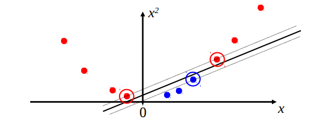
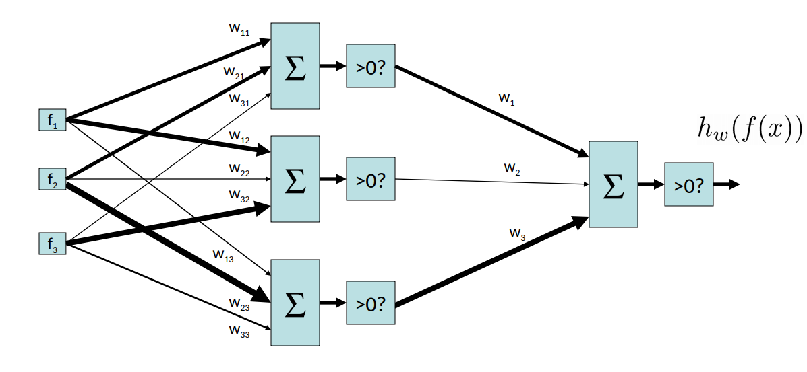
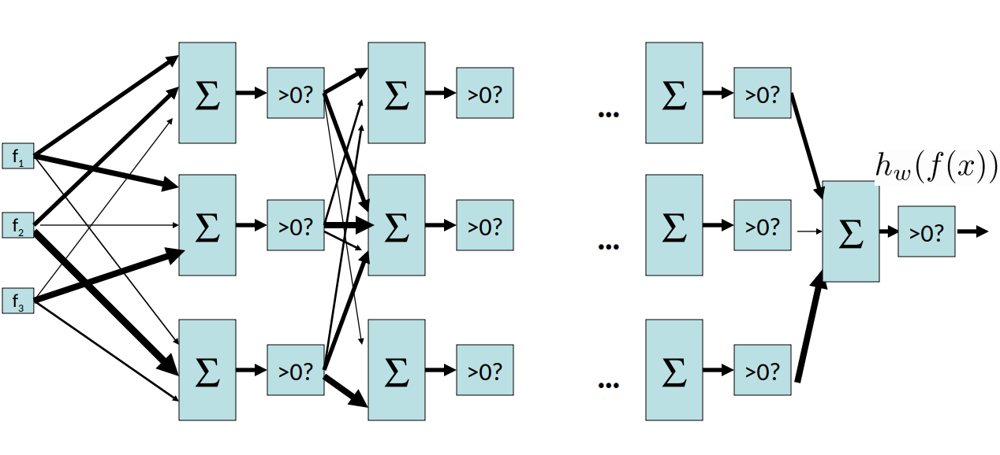
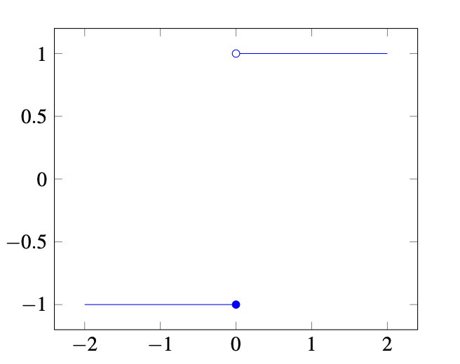
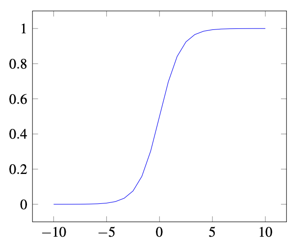

# 10.1 Neural Networks: Motivation

In what follows we will introduce the concept of a neural network. In doing so, we will be using some of the modeling techniques we developed for binary logistic and multi-class logistic regression.

## 10.1.1 Non-linear Separators

We know how to construct a model that learns a linear boundary for binary classification tasks. This is a powerful technique, and one that works well when the underlying optimal decision boundary is itself linear. However, many practical problems involve the need for decision boundaries that are nonlinear in nature, and our linear perceptron model isn't expressive enough to capture this relationship.

Consider the following set of data:

We would like to separate the two colors, and clearly there is no way this can be done in a single dimension (a single dimensional decision boundary would be a point, separating the axis into two regions).  
To fix this problem, we can add additional (potentially nonlinear) features to construct a decision boundary. Consider the same dataset with the addition of $$x^2$$ as a feature:

With this additional piece of information, we are now able to construct a linear separator in the two-dimensional space containing the points. In this case, we were able to fix the problem by mapping our data to a higher dimensional space by manually adding useful features to data points. However, in many high-dimensional problems, such as image classification, manually selecting useful features is tedious. This requires domain-specific expertise and works against the goal of generalization across tasks. A natural desire is to learn these feature transformations as well, using a nonlinear function class capable of representing a wider variety of functions.

## 10.1.2 Multi-layer Perceptron

Let's examine how we can derive a more complex function from our original perceptron architecture. Consider the following setup, a two-layer perceptron, which is a perceptron that takes as input the outputs of another perceptron.

In fact, we can generalize this to an N-layer perceptron:

With this additional structure and weights, we can express a much wider set of functions.

By increasing the complexity of our model, we greatly increase its expressive power. Multi-layer perceptrons give us a generic way to represent a much wider set of functions. In fact, a multi-layer perceptron is a **universal function approximator** and can represent _any_ real function, leaving us only with the problem of selecting the best set of weights to parameterize our network. This is formally stated below:

### 10.1.2.1 Theorem. (Universal Function Approximators)

A two-layer neural network with a sufficient number of neurons can approximate any continuous function to any desired accuracy.

## 10.1.3 Measuring Accuracy

The accuracy of the binary perceptron after making $$n$$ predictions can be expressed as:

$$
l^{acc}(\mathbf{w}) = \frac{1}{n}\sum_{i=1}^n(\textrm{sgn}(\mathbf{w} \cdot \mathbf{f}(\mathbf{x}_{i}))== y_{i})
$$

where $$\mathbf{x}_{i}$$ is data point $$i$$, $$\mathbf{w}$$ is our weight vector, $$\mathbf{f}$$ is our function that derives a feature vector from a raw data point, and $$y_{i}$$ is the actual class label of $$\mathbf{x}_{i}$$. In this context, $$\textrm{sgn}(x)$$ represents an **indicator function**, which evaluates to $$-1$$ when $$x$$ is negative, and $$1$$ when $$x$$ is positive. Our accuracy function is equivalent to dividing the total number of _correct_ predictions by the total number of predictions.

Sometimes, we want an output more expressive than a binary label. It then becomes useful to produce a probability for each of the \( N \) classes, reflecting our degree of certainty that the data point belongs to each class. As in multi-class logistic regression, we store a weight vector for each class \( j \), and estimate probabilities with the softmax function:

$$
\sigma (\mathbf{x}_{i})_j = \frac{e^{\mathbf{f}(\mathbf{x}_{i})^T \mathbf{w}_j}}{\sum_{\ell=1}^Ne^{\mathbf{f}(\mathbf{x}_{i})^T \mathbf{w}_\ell}} = P(y_{i} = j | \mathbf{f}(\mathbf{x}_{i});\mathbf{w}).
$$

Given a vector output by $$\mathbf{f}$$, softmax normalizes it to output a probability distribution. To derive a general loss function for our models, we can use this probability distribution to generate an expression for the likelihood of a set of weights:

$$
\ell(\mathbf{w}) = \prod_{i=1}^nP(y_{i} | \mathbf{f}(\mathbf{x}_{i}); \mathbf{w}).
$$

This expression denotes the likelihood of a particular set of weights explaining the observed labels and data points. We seek the set of weights that maximizes this quantity. This is equivalent to finding the maximum of the log-likelihood expression:

$$
\log\ell(\mathbf{w}) = \log \prod_{i=1}^n P(y_{i} | x_{i}; \mathbf{w}) = \sum_{i=1}^n \log P(y_{i} | \mathbf{f}(\mathbf{x}_{i}); \mathbf{w}).
$$

## 10.1.4 Multi-layer Feedforward Neural Networks

We now introduce the idea of an artificial neural network. Like the multi-layer perceptron, we choose a non-linearity to apply after each perceptron node. These added non-linearities make the network as a whole non-linear and more expressive. Without them, a multi-layer perceptron would simply be a composition of linear functions and hence still linear.

In the case of a multi-layer perceptron, we chose a step function:

$$
f(x) = \begin{cases} 
1 & \text{if } x \ge 0 \\
-1 & \text{otherwise}
\end{cases}
$$

Graphically, it looks like this:

This is difficult to optimize because it is not continuous and has a derivative of zero at all points. Instead of using a step function, a better solution is to select a continuous function, such as the **sigmoid function** or the **rectified linear unit (ReLU)**.

### 10.1.4.1 Sigmoid Function: 

$$
\sigma(x) = \frac{1}{1 + e^{-x}}
$$

### 10.1.4.2 ReLU: 

$$
f(x) = \begin{cases} 
0 & \text{if } x < 0 \\
x & \text{if } x \ge 0 
\end{cases}
$$

In a multi-layer perceptron, we apply one of these non-linearities at the output of each layer. The choice of non-linearity is a design decision that typically requires experimentation.

## 10.1.5 Loss Functions and Multivariate Optimization

Now that we understand how a feed-forward neural network is constructed, we need a way to train it. Returning to our log-likelihood function, we can derive an intuitive algorithm to optimize our weights.

To maximize our log-likelihood function, we differentiate it to obtain a **gradient vector**:

$$
\nabla_w  \ell (\mathbf{w}) = \left[\frac{\partial \ell(\mathbf{w})}{\partial \mathbf{w}_1}, ..., \frac{\partial \ell(\mathbf{w})}{\partial \mathbf{w}_n}\right].
$$

We find the optimal values of the parameters using the gradient ascent method. Given that datasets are usually large, batch gradient ascent is the most popular variation of gradient ascent in neural network optimization.